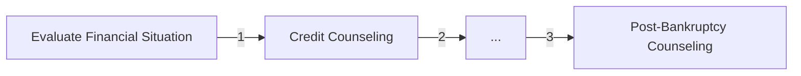

<style>
.slidev-code {
    height: 90%;
    overflow-y: scroll;
}
</style>

# Declarative Thinking for Qt Developers

> Furkan Uzumcu
>
> ·[Autodesk](https://www.autodesk.com/products/alias-products/overview)
>
> [GitHub/Furkanzmc](https://github.com/Furkanzmc)
>
> [zmc.space](https://zmc.space)
>
> [furkan.uzumcu@autodesk.com](mailto:furkan.uzumcu@autodesk.com)

---
layout: center
---

# Declarative Programming in a Nutshell


<!--
- A declaration of the desired outcome, the what of the desire, not the how.
- It is also about creating relationships.
-->

---
layout: center
---

# Imperative Programming in a Nutshell



<!--
- A step by step guide to achieving a desired outcome
- Each step changes the state
-->

---
layout: image-right
image: /assets/he-man.jpg
---

- Ease of understanding and conciseness in declarative style
- Power and control in imperative style

<!--
- It's up to us to pick to most appropriate style for the problem domain we are in and the
  problem we are solving.
- Each step changes the state.
-->

---
layout: center
---

> Computer Science in the 1960s to 80s spent a lot of effort making languages which were as
> powerful as possible. Nowadays we have to appreciate the reasons for picking not the most
> powerful solution but the least powerful. - Tim Berners-Lee,
> https://www.w3.org/DesignIssues/Principles.html

<br>
<br>

<v-click>

> ... our intellectual powers are rather geared to master **static relations** and that our
> powers to visualize **processes evolving in time** are relatively poorly developed. - Edsger
> W. Dijkstra, A Case Against the GO TO Statement

</v-click>

<!--
- Choosing the right tool for the job is important
- Choosing less powerful language is more important as the abstraction layer increases
- Static relationships are better than changing states
- Easier to comprehend declarative code with one look than imperative code
- Smalltalk was invented to solve this problem.
- New domains of problem require new domains of solutions.
- Events and signals are what increases the processes evolving over time.
-->

---
layout: center
---

```cpp
vector<int> numbers{1, 2, 3, 4, 5};
for (size_t i = 0; i < numbers.size(); ++i) {
  numbers[i] *= 2;
}
```

---
layout: center
---

> All problems in computer science can be solved by another level of indirection, except for the
> problem of too many layers of indirection. – David J. Wheeler

<!--
- What is an abstraction here that we can use to improve the code?
-->

---

```cpp
vector<int> numbers{1, 2, 3, 4, 5};
for (size_t i = 0; i < numbers.size(); ++i) {
  numbers[i] *= 2;
}
```

<br>

<v-click>

```cpp
vector<int> numbers{1, 2, 3, 4, 5};
for (int &num : numbers) {
  num *= 2;
}
```

</v-click>

<br>

<v-click>

```cpp
vector<int> numbers{1, 2, 3, 4, 5};
transform(numbers.begin(), numbers.end(), numbers.begin(),
          [](int num) { return num * 2; });
```
</v-click>

<br>

<v-click>

```cpp
vector<int> numbers =
    ints_range(1, 5) | transform([](int num) { return num * 2; });
```
</v-click>

<!--
- Functional programming is a form of declarative programming.
- With each example, there's less state change.
-->

---

Let's go back...

> ... our intellectual powers are rather geared to master **static relations** and that our
> powers to visualize **processes evolving in time** are relatively poorly developed. - Edsger
> W. Dijkstra, A Case Against the GO TO Statement

<!--
- Talk about the mental model of declarative programming.
- Establish relationships once, let it grow.
- One of the influential quotes for me. Look for ways to make things static, immutable,
  unchanging.
-->

---
layout: center
---

> Signal-to-noise ratio (SNR or S/N) is a measure used in science and engineering that compares
> the level of a desired signal to the level of background noise.
> - https://en.wikipedia.org/wiki/Signal-to-noise_ratio

<br>
<br>

<v-click>

Find a model for description that *improves* the signal to noise ratio.

</v-click>

<!--
- Model for description will change depending on the problem.
- When writing low level code, you won't rely on declarative programming, but maybe
  declarative data description.
- Abstraction levels are supposed to make things easier to understand, not harder. Ports and
  adapters?
-->

---


Noisy...

```cpp
vector<int> numbers{1, 2, 3, 4, 5};
for (size_t i = 0; i < numbers.size(); ++i) {
  numbers[i] *= 2;
}
```

<br>
<br>

<v-click>

Not so much (?)...

```cpp
vector<int> numbers =
    ints_range(1, 5) | transform([](int num) { return num * 2; });
```
</v-click>

<!--
- This doesn't just apply to code, it also applies to communicating to other engineers and
  stakeholders.
- Brain works extra hard to understand the first code
-->

---

# QWidget

```cpp
QWidget window;
window.setGeometry(100, 100, 300, 200);

QHBoxLayout *layout = new QHBoxLayout(&window);
QPushButton *incButton = new QPushButton("Increment", &window);
QPushButton *decButton = new QPushButton("Decrement", &window);
QLabel *counterLabel = new QLabel("0", &window);

layout->addWidget(incButton);
layout->addWidget(decButton);
layout->addWidget(counterLabel);

int counter = 0;
QObject::connect(incButton, &QPushButton::clicked, [&counter, counterLabel]() {
  counter++;
  counterLabel->setText(QString::number(counter));
});

QObject::connect(decButton, &QPushButton::clicked, [&counter, counterLabel]() {
  counter--;
  counterLabel->setText(QString::number(counter));
});

window.show();
```

---

# QML

```qml
ApplicationWindow {
    Row {
        spacing: 2

        Button {
            text: "Increment"
            onClicked: text.counter++
        }

        Button {
            text: "Decrement"
            onClicked: text.counter--
        }

        Label {
            id: text

            property int counter: 0

            text: counter
        }
    }
}
```

<!--
Any guesses as to what this looks like?
-->

---
layout: center
---


---

# Rules of Thumb

- Reveal intention
- Think in terms of (Binding?) relationships and outcomes
- Eyes move more left to right than top to bottom
- More bindings, less signal handlers
- Think in terms of values, not mechanics

<!--
- Try to reduce the number of signals you are calling, this is essentially like goto
-->

---

# Reveal Intention

```cpp
struct time {
  time(int hour, int minute);

  int get_hour() const {}
  int get_minute() const {}
};
```

<br>
<br>

<v-click>

```cpp
struct time {
  time(int hour, int minute);

  int hour() const {}
  int minute() const {}
};
```

</v-click>

<!---
- To get something implies side effect. Get money from ATM, get married...
- Qt already uses this naming scheme
-->

---

# Binding Relationships

```qml
Button {
    id: btn
    onHoveredChanged: {
        background.color = hovered ? "green" : "red"
    }
    background: Rectangle { }
}
```

<br>

<v-click>

```qml
Button {
    id: btn
    background: Rectangle {
        color: btn.hovered ? "green" : "red"
    }
}
```

</v-click>

---

# Eyes Top to Bottom

```qml
ListView {
    model: ContactModel { }
    delegate: Label {
        id: dlg

        required property int index
        required property string name

        Component.onCompleted: {
            text = index + ". " + name
            rect.visible = dlg.index % 2
        }

        Rectangle {
            id: rect
        }
    }
}
```

---

# Eyes Left to Right

```qml
ListView {
    model: ContactModel { }
    delegate: Label {
        id: dlg

        required property int index
        required property string name

        text: index + ". " + name

        Rectangle {
            visible: dlg.index % 2
        }
    }
}
```

<!--
- What are the downsides?
- Eyes should go left to right, not top to bottom
-->

---

# Considerations

1. Readability and Maintainability:

**Declarative:** Typically leads to more readable and maintainable code. It focuses on what needs
to be achieved rather than how to achieve it.

**Imperative:** Can be more verbose and require understanding of the control flow. May be harder to
read for complex logic.

<v-click>

```javascript
const numbers = [1, 2, 3, 4, 5, 6];
let filteredAndDoubled = [];
for (let i = 0; i < numbers.length; i++) {
    if (numbers[i] % 2 === 0) {
        filteredAndDoubled.push(numbers[i] * 2);
    }
}
```

</v-click>

<v-click>

```javascript
const numbers = [1, 2, 3, 4, 5, 6];

const filteredAndDoubled = numbers
    .filter(number => number % 2 === 0)
    .map(number => number * 2);
```

</v-click>

---

2. Complexity of Logic:

**Declarative:** Well-suited for scenarios where the logic is complex or involves a lot of data
manipulation. Declarative languages often abstract away low-level details.

**Imperative:** Can be
beneficial when the logic is straightforward and the step-by-step execution is easy to understand.

<v-click>

```cpp
vector<int> numbers = {1, 2, 3, 4, 5, 6};
int sum = 0;
for (int i = 0; i < numbers.size(); ++i) {
  if (numbers[i] % 2 == 0) {
    sum += numbers[i] * numbers[i];
  }
}
```

</v-click>

<v-click>

```cpp
vector<int> numbers = {1, 2, 3, 4, 5, 6};
const int sum = accumulate(numbers | filter([](int number) { return number % 2 == 0; })
                | transform([](int number) { return number * number; }), 0);
```

</v-click>

---


3. Domain-Specific Languages (DSLs):

**Declarative:** Often used for creating DSLs, especially in configuration files and
domain-specific scenarios (e.g., SQL for databases, QML for UIs).

**Imperative:** Might be more suitable for general-purpose programming.

---

# Swift

```swift
override func viewDidLoad() {
    let incrementButton = UIButton(type: .system)
    incrementButton.setTitle("Increment", for: .normal)
    incrementButton.addTarget(self, action: #selector(increment), for: .touchUpInside)

    let decrementButton = UIButton(type: .system)
    decrementButton.setTitle("Decrement", for: .normal)
    decrementButton.addTarget(self, action: #selector(decrement), for: .touchUpInside)

    counterLabel.text = "\(counter)"
    let stackView = UIStackView(arrangedSubviews: [incrementButton, decrementButton, counterLabel])
    stackView.axis = .vertical
    stackView.spacing = 10

    view.addSubview(stackView)
    stackView.translatesAutoresizingMaskIntoConstraints = false
    NSLayoutConstraint.activate([
        stackView.centerXAnchor.constraint(equalTo: view.centerXAnchor),
        stackView.centerYAnchor.constraint(equalTo: view.centerYAnchor)
    ])
}
```

---

# SwiftUI

```swift
struct ContentView: View {
    @State private var counter = 0

    var body: some View {
        VStack {
            HStack(spacing: 10) {
                Button("Increment") {
                    counter += 1
                }

                Button("Decrement") {
                    counter -= 1
                }

                Text("\(counter)")
            }
        }
        .padding()
    }
}
```

---

# Kotlin [Android]

```kotlin
override fun onCreate(savedInstanceState: Bundle?) {
    super.onCreate(savedInstanceState)

    val layout = LinearLayout(this)
    layout.orientation = LinearLayout.VERTICAL
    layout.gravity = Gravity.CENTER

    val incrementButton = Button(this)
    incrementButton.text = "Increment"
    incrementButton.setOnClickListener { onIncrementClick() }
    layout.addView(incrementButton)

    val decrementButton = Button(this)
    decrementButton.text = "Decrement"
    decrementButton.setOnClickListener { onDecrementClick() }
    layout.addView(decrementButton)

    counterLabel = TextView(this)
    counterLabel.text = "0"
    counterLabel.textSize = 24f
    layout.addView(counterLabel)

    setContentView(layout)
}
```

---

# XML [Android]

```xml
<?xml version="1.0" encoding="utf-8"?>
<RelativeLayout xmlns:android="http://schemas.android.com/apk/res/android"
    android:layout_width="match_parent"
    android:layout_height="match_parent"
    tools:context=".MainActivity">

    <Button
        android:id="@+id/incrementButton"
        android:onClick="onIncrementClick"/>
        <!-- ... -->

    <Button
        android:id="@+id/decrementButton"
        android:onClick="onDecrementClick"/>
        <!-- ... -->

    <TextView
        android:id="@+id/counterLabel"
        android:text="0"
        <!-- ... -->
</RelativeLayout>
```

---

# QWidget

```cpp
QWidget window;
window.setGeometry(100, 100, 300, 200);

QHBoxLayout *layout = new QHBoxLayout(&window);
QPushButton *incButton = new QPushButton("Increment", &window);
QPushButton *decButton = new QPushButton("Decrement", &window);
QLabel *counterLabel = new QLabel("0", &window);

layout->addWidget(incButton);
layout->addWidget(decButton);
layout->addWidget(counterLabel);

int counter = 0;
QObject::connect(incButton, &QPushButton::clicked, [&counter, counterLabel]() {
  counter++;
  counterLabel->setText(QString::number(counter));
});

QObject::connect(decButton, &QPushButton::clicked, [&counter, counterLabel]() {
  counter--;
  counterLabel->setText(QString::number(counter));
});

window.show();
```

---

# QML

```qml
ApplicationWindow {
    Row {
        spacing: 2

        Button {
            text: "Increment"
            onClicked: text.counter++
        }

        Button {
            text: "Decrement"
            onClicked: text.counter--
        }

        Label {
            id: text

            property int counter: 0

            text: counter
        }
    }
}
```

---

4. State Management:

**Declarative:** Tends to have clearer approaches to managing state changes.

**Imperative:** Requires more careful handling of state changes, which can lead to bugs related to
mutable state.

```qml
Rectangle {
    color: root.pressed ? "green" : "red"
    radius: root.hovered ? 0 : 10
    border.color: root.hovered ? "red" : "green"
    border.width: root.clickCount
    // ...
    states: [
        State {
            when: condition
            // ...
        }
    ]
}
```

---

5. Learning Curve:

**Declarative:** Often has a steeper learning curve initially, especially for those accustomed to
imperative programming.

**Imperative:** Generally more familiar to beginners and can be easier to learn.

---

# Thank You!
